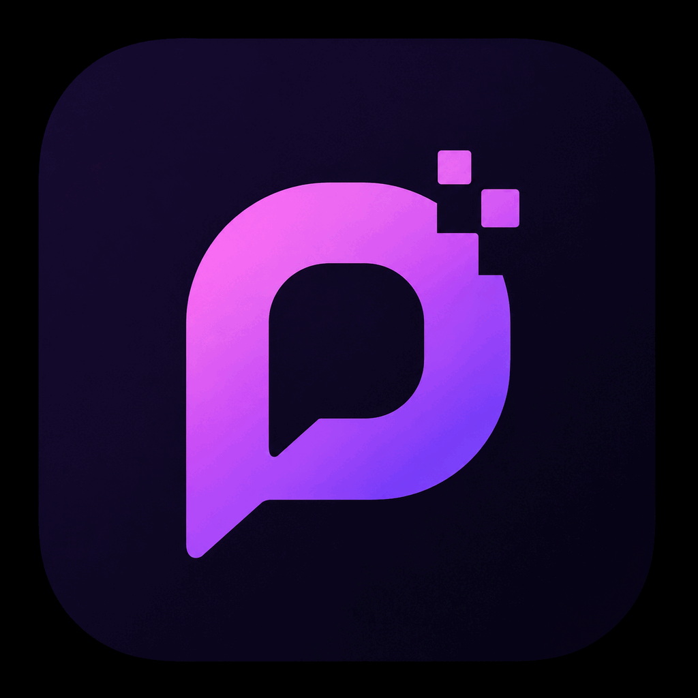
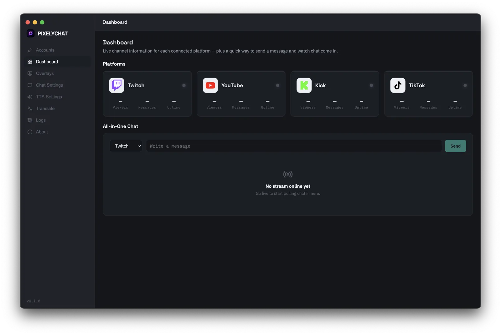
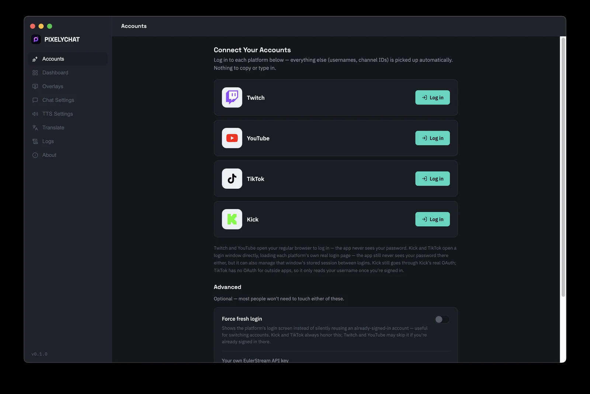
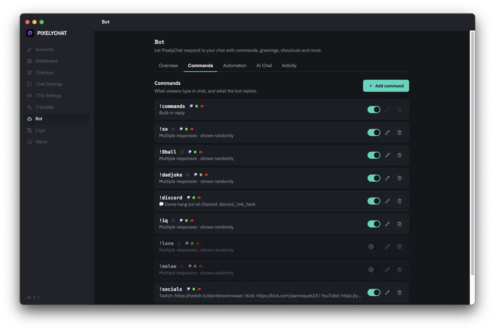
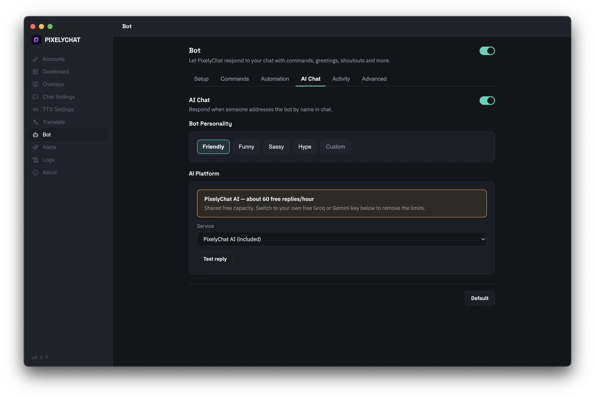
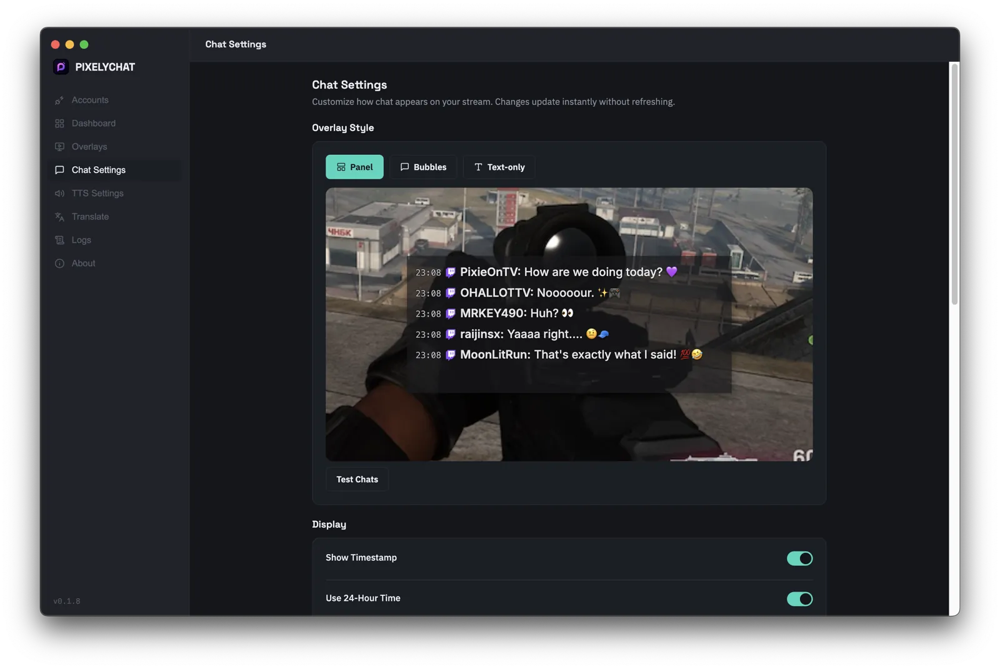
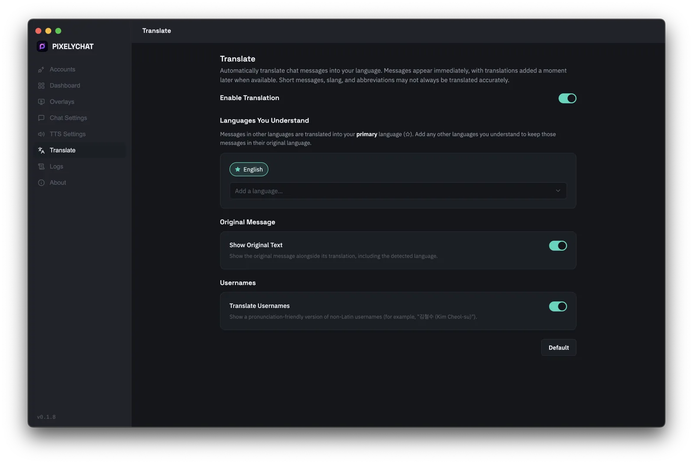
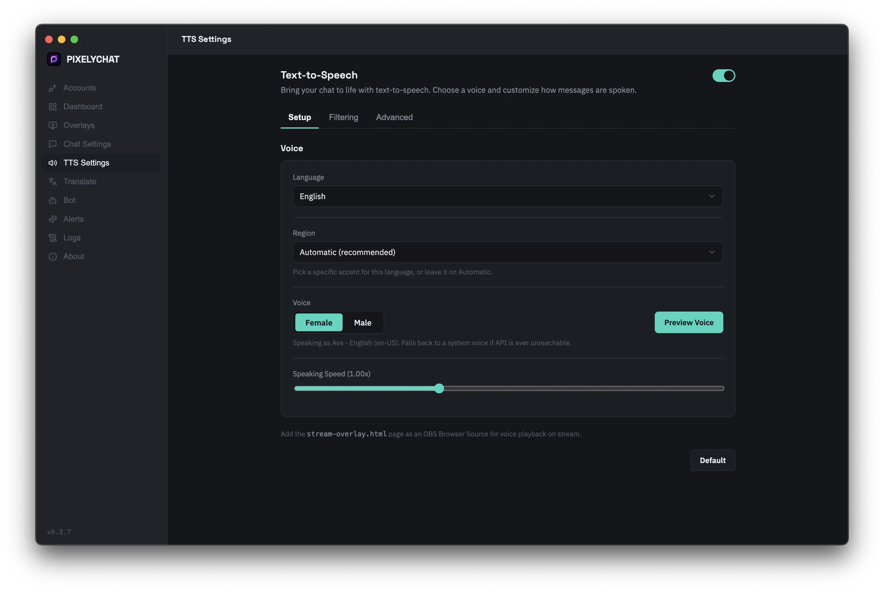
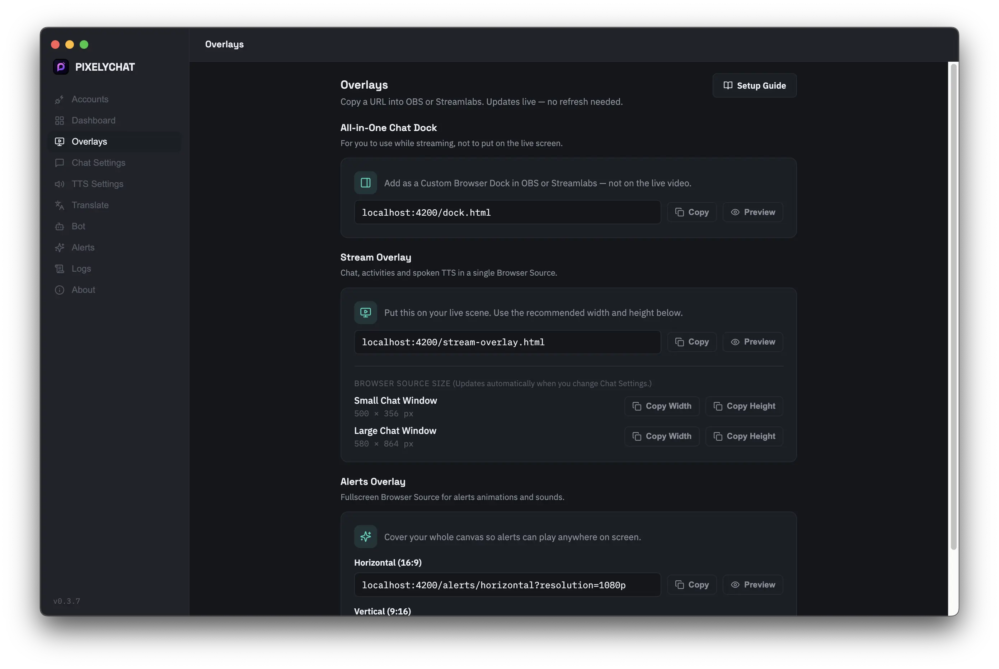

# PixelyChat

### One Chat. Every Platform.

PixelyChat pulls your Twitch, YouTube, Kick, and TikTok chat into one unified feed —
moderated, spoken aloud, translated on the fly, and backed by a built-in chat bot with an AI co-host.

Built by a streamer who'd rather be playing than managing five chat windows.

[Download](#-download) · [Features](#-features) · [Screenshots](#-screenshots) · [FAQ](#-faq) · [Support](#-support--community)

---

## About

PixelyChat is a desktop app for live streamers. It connects to **Twitch, YouTube, Kick, and TikTok** and merges all four chats into a single feed — readable in-app, moderated, read aloud with text-to-speech, backed by a chat bot with commands and an AI co-host, and displayed live on stream through an OBS/Streamlabs overlay.

It's made by **PixieOnTV**, a variety gaming streamer who got tired of multi-platform chat tools either missing what she needed or requiring a computer science degree to configure. She built it for her own stream first — then figured other streamers fighting the same chat chaos might want it too.

> This repository hosts **built releases only**. PixelyChat's source lives in a private repository while it's under active development; this page exists so anyone can download and follow along with new versions.

---

## 🖼 Screenshots

<table>
<tr>
<td width="50%">

**Dashboard**
Live viewer counts, message activity, and uptime for every connected platform, plus a quick way to send a message.

</td>
<td width="50%">

**Account Setup**
Log in to each platform once — PixelyChat picks up your username and channel details automatically. No stream keys, no copying channel IDs.

</td>
</tr>
<tr>
<td width="50%">

**A Chat Bot That's Actually Fun**
!so, !8ball, !dadjoke, !iq, and more — ready to go the moment you turn it on, each with several randomized replies. Set cooldowns and access levels, then let greetings, shoutouts, and follow/sub/raid alerts fire automatically.

</td>
<td width="50%">

**An AI Co-Host For Your Chat**
@mention your bot and it actually replies — pick a personality (Friendly, Funny, Sassy, Hype, or write your own). Free hosted AI included out of the box, no API key or signup required.

</td>
</tr>
<tr>
<td width="50%">

**Customizable Overlays**
Panel, bubbles, or plain text. Toggle avatars, timestamps, and platform icons, or give each platform its own color.

</td>
<td width="50%">

**Live Translation**
Foreign-language chat is translated into your language automatically — no API key, no signup, original text kept alongside it.

</td>
</tr>
<tr>
<td width="50%">

**Text-to-Speech**
Chat read aloud in a natural voice. Control speed, ignore specific users or bots, and cap it so a raid doesn't leave TTS reading for five minutes straight.

</td>
<td width="50%">

**One-Click OBS/Streamlabs Overlays**
Copy one URL, paste it into a Browser Source, done. Every style change updates the overlay live.

</td>
</tr>
</table>

---

## ✨ Features

- **Unified chat** — every message, from every platform, in a single feed
- **Four platforms at once** — Twitch, YouTube, Kick, and TikTok, all connected simultaneously
- **Chat bot with custom commands** — !so, !8ball, and more out of the box, plus your own commands, cooldowns, access levels, greetings, shoutouts, and follow/sub/raid alerts
- **AI co-host** — @mention it and it replies in a personality you pick; free hosted AI included, no API key required
- **Built-in chat moderation** — delete messages and block or timeout users directly from the unified chat
- **Live translation** — automatic, no API key required, original text preserved alongside it
- **Text-to-speech** — natural voices, per-user/bot ignore lists, spam/raid protection
- **Instant OBS & Streamlabs overlays** — one URL, live-updating styles, zero added latency
- **External emote support** — 7TV, BTTV, and FrankerFaceZ render alongside native emotes
- **Live viewer & message stats** — side-by-side per-platform activity on the Dashboard
- **Lightweight by design** — runs quietly in the background so your CPU/GPU stays free for your game and encoder
- **Runs 100% locally** — no PixelyChat servers in the loop; your chat data and login tokens never leave your machine

---

## 📥 Download

**Windows** — [Microsoft Store](https://apps.microsoft.com/detail/9MX361W4VSFS) (recommended — automatic updates, no SmartScreen warning) or the direct `.exe` from the [Releases page](https://github.com/pixieontv/pixelychat-releases/releases/latest).

**macOS & Linux:**

**➡️ Grab the latest version from the [Releases page](https://github.com/pixieontv/pixelychat-releases/releases/latest).**

No payment, no account, no catch — every feature is free and stays free.

---

## ❓ FAQ

**Does PixelyChat support Kick chat?**
Yes — Kick is fully supported alongside Twitch, YouTube, and TikTok. Kick chat shows up in your unified feed, gets read aloud by TTS, and appears in your overlay exactly like the other platforms.

**Is PixelyChat safe to use with my YouTube/Google account?**
Yes. PixelyChat uses the official Google OAuth 2.0 flow — you sign in through Google's own page, and PixelyChat never sees your password.

**Does PixelyChat collect or sell my data?**
No. PixelyChat runs locally on your computer. Chat data, login tokens, and settings stay on your machine.

**Is it really free?**
Yes — every feature is free and stays free. [Donations](https://streamelements.com/pixieontv/tip) are appreciated but never required.

**How do you make money if it's free?**
Right now, I don't — this is a personal project, not a company, and it's currently supported entirely by [donations](https://streamelements.com/pixieontv/tip). No ads, no selling data. Down the line I may add some optional commercial features, but everything the app does today stays free.

**How do the OBS/Streamlabs overlays work?**
PixelyChat runs a small local web server on your own machine. Point a Browser Source at the URL it gives you — zero latency, nothing sent over the internet.

**Does it moderate my chat?**
Yes — PixelyChat includes built-in mod tools so you can delete messages and block or timeout users directly from the unified chat. You can still use your platform's native tools or bots like Nightbot/StreamElements/Streamer.bot alongside it if you prefer.

---

## 💬 Support & Community

| | |
|---|---|
| 🐛 **Support / bug reports** | [support@pixelychat.com](mailto:support@pixelychat.com) |
| 💬 **Discord community** | [discord.gg/NjC9cUgdfQ](https://discord.gg/NjC9cUgdfQ) |
| 🔗 **Links / socials** | [beacons.ai/pixieontv](https://beacons.ai/pixieontv) |
| 💜 **Support development** | [Donate](https://streamelements.com/pixieontv/tip) |

---

Not affiliated with Twitch, YouTube, Kick, or TikTok.

